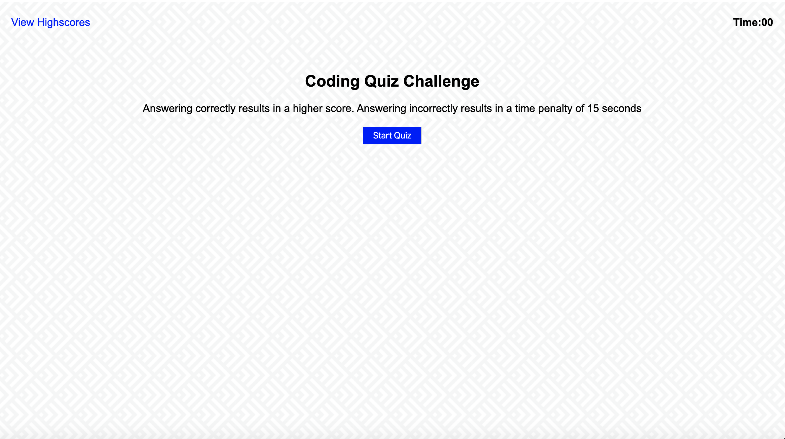

# coding-quiz
Javascript Coding Challenge

## Description: 
This application is a timer-based quiz application that stores high scores client-side.

## Usage:
1. The user arrives at the landing page and is presented with a call-to-action to "Start Quiz." Header has the "View Highscores" and the "Time" value set at 0.

2. Clicking the "Start Quiz" button presents the user with a series of questions. The timer is initialized with a value and immediately begins countdown.

3. Score is calculated by time remaining. Answering correctly results in a higher score. Answering incorrectly results in a time penalty of 15 seconds.( subtracted from time remaining).

4. When time runs out and/or all questions are answered, the user is presented with their final score and asked to enter their initials. Their final score and initials are then stored in localStorage.

5. View High scores page displays the scores from highest to lowest.

## Screenshots:

